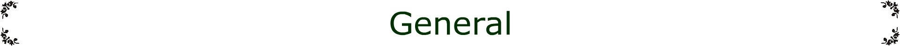
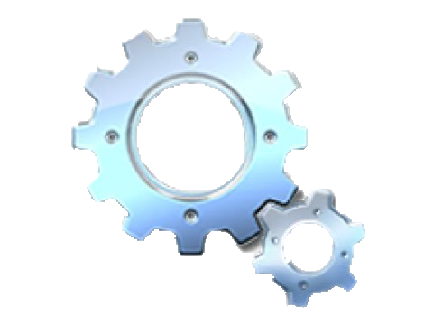

<!-- Navigation -->
<nav id="nav-projects">
  <section class="filter-checkbox-container" title="Show/hide (default, progress, done, low, medium, high) tasks.">
    <input type="checkbox" id="default-filter" class="filter-checkbox" checked />
    <input type="checkbox" id="low-filter" class="filter-checkbox" checked />
    <input type="checkbox" id="medium-filter" class="filter-checkbox" checked />
    <input type="checkbox" id="high-filter" class="filter-checkbox" checked />
    <input type="checkbox" id="progress-filter" class="filter-checkbox" checked />
    <input type="checkbox" id="done-filter" class="filter-checkbox" checked />
    <textarea id="save-filter" class="clipboard-textarea-plain"  onclick="clipboardCopy(this)" title="Copy SAVED_FILTERS string data to clipboard." readonly></textarea>
  </section>
  
  <section class="minimize-checkbox-container" title="Show/hide (default, progress, done, low, medium, high) descriptions (minizimize).">
    <input type="checkbox" id="default-minimize" class="filter-checkbox" checked />
    <input type="checkbox" id="low-minimize" class="filter-checkbox" checked />
    <input type="checkbox" id="medium-minimize" class="filter-checkbox" checked />
    <input type="checkbox" id="high-minimize" class="filter-checkbox" checked />
    <input type="checkbox" id="progress-minimize" class="filter-checkbox" checked />
    <input type="checkbox" id="done-minimize" class="filter-checkbox" checked />
  </section>
<!--
  
  <a href="#general" onclick="hide('job-batch')">
  General
  </a>
  
  <a href="#job-batch" high-priority title="This is a hover-state example">
  Job batches
  </a>
  
  
-->
</nav>

<!--

  <name>
  Batch some jobs together
  </name>

  <description>
  
  My description is super awesome!
  I like turtles.
   

  - List item A
  - List item B
  - List item C
  </description>

-->

