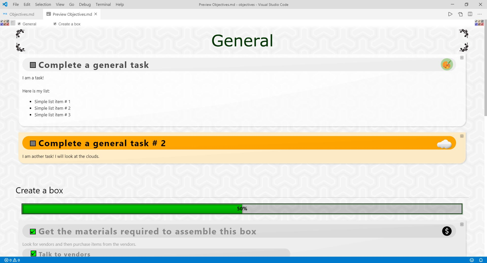

<h1>Objectives.md</h1>

Objectives is a TODO-type application built specifically for the <b>Visual Studio Code 
markdown preview mode</b> (CTRL + SHIFT + V).

</img>

# Features

Create your own projects and tasks using the <b>MY_PROJECTS</b> object.

```javascript
var MY_PROJECTS = [{

  projectName: "My awesome project",
  projectId: "awesome-project",
  projectProgress: -1,
  projectProgressTitle: "33%:   1nd portion complete\n\n66%:   2rd portion complete\n\n100%: Project complete",
  projectHidden: false,
  projectImage: {
    src: "img/project-image.png",
    style: []
  },

  tasks: [
  {
    name: "Create job application batch commands",
    taskName: "Job Batch",
    taskId: "job-batch",
    taskProgress: 55,
    taskProgressTitle: "Complete this task! You can do it!",
    status: "HIGH",
    inProgress: true,
    description: `
      <span left>This is an HTML description!</span>
      <a href="http://www.google.com">Go to google!</a></span>

      <ul>
        <li>Awesome list</li>
        <li>Awesome stuff</li>
        <li>Cool beans</li>
      </ul>
    `,
    taskImage: {
      src: "task-img/cool-image.png",
      style: [
        ["width", "55px"],
        ["height", "auto"],
        ["marginRight", "10px"]
      ]
    }
  },
  {
    name: "Simple Task # 2",
    taskName: "Task 2",
    taskId: "task-2",
    status: "LOW",
    inProgress: false,
    description: ``,
    taskImage: {
      src: "task-img/another-image.png",
    }
  }]

}]
```

# The <b>MY_PROJECTS</b> object

This is the primary feature of this application. It dynamically load the data from this object and 
displays it accordingly.

The general structure of the MY_PROJECTS object is as follows:

    MY_PROJECTS
    |
    |– sample_project_1
    |   |– sample_task_1
    |   |– sample_task_2
    |   |– sample_task_3
    |
    |– sample_project_2
    |   |– sample_task_1
    |   |– sample_task_2
    |
    |– sample_project_3
    |   sample_task_1
    |
    |– sample_project_4
    |   |– sample_task_1
    |   |– sample_task_2
    |   |– sample_task_3
    |   |– sample_task_4
    |
    |– sample_project_n
    |   |– sample_task_n
    .   .
    .   .

Each property of a 'project' object has an association to that project.
Here are a list of project properties and their purpose:

## Project Name <b>(REQUIRED)</b>

```javascript
projectName: "My awesome project",
```

This is the name of your project.  

## Project Identification text <b>(REQUIRED)</b>

```javascript
projectId: "awesome-project",
```

The project id is important for the source code to be able to accurately map each project to the DOM.

<b>Project ids MUST be unique.</b> There should only be <b>one</b> project named 'my-project' for example.

## Project Progress (optional)

```javascript
projectProgress: -1,
```

Displays a progress bar for this project. You have to manually update this number if you wish (preferably when you make progress).

When the projectProgress value is -1 or null, the bar <b>will not</b> be displayed.

However, if the value is 0 - 100 it will display.

A bar at 100 will have <i>special</i> CSS attached showing that it is <b>completed</b>.

## Project Progess Hover Text (optional)

```javascript
projectProgressTitle: "33%:   1nd portion complete\n\n66%:   2rd portion complete\n\n100%: Project complete"
```

Text to display when the progress bar is hovered.

## Project Hidden <b>(REQUIRED)</b>

```javascript
projectHidden: false,
```

Determines if the project is hidden.

## Project Image (optional)

```javascript
projectImage: {
  src: "img/project-image.png",
  style: []
},
```
Image of the project. This can be local or from a remote location.
src (string) - the URL of the requested image
style (array) - an object which contains CSS to be applied to the image.

    style: [
      ["width", "auto"],
      ["height", "40px"],
      ["marginRight", "10px"],
      ["marginTop", "2px"]
    ]

## Project tasks <b>(REQUIRED)</b>

```javascript
tasks: [
  // All tasks (objects) for this project
]
```

Contains all tasks for the current project. Tasks are objects.

# The <b>tasks</b> (object) array

All tasks for a project are in the 'tasks' array. All tasks are displayed underneath the project it belongs to.

Here are a list of what each task property does:

## Task Name <b>(REQUIRED)</b>

```javascript
name: "Create job application batch commands",
```
The display name of the current task. This name is displayed large at the top of every task.

## Nav-bar Task Name <b>(REQUIRED)</b>

```javascript
taskName: "Job Batch",
```
The internal name of the task. This name is used in the nav display for this task.

## Task Identification text <b>(REQUIRED)</b>

```javascript
taskId: "job-batch",
```
The task id for the task. This is specific to the task and is required by the code to properly attach it.

<b>Task ids MUST be unique.</b> There should only be <b>one</b> task named 'my-task' for example.

## Task Progress (optional)

```javascript
taskProgress: -1,
```

Displays a progress bar for this task. You have to manually update this number if you wish (preferably when you make progress).

When the taskProgress value is -1 or null, the bar <b>will not</b> be displayed.

However, if the value is 0 - 100 it will display.

A bar at 100 will have <i>special</i> CSS attached showing that it is <b>completed</b>.

## Task Progess Hover Text (optional)

```javascript
taskProgressTitle: "Complete this task! You can do it!",
```

Text to display when the task progress bar is hovered.

## Task Status <b>(REQUIRED)</b>

```javascript
status: "HIGH",
```

The current status of the task. This is attribute handles the priority-level and completion of the task.

A task can be any in any of the following states.

    "HIGH": Task is of high priority.
    "MEDIUM": Task is of medium priority.
    "LOW": Task is of low priority.
    "": Task is has no priority.
    "DONE": Task is complete.

## Task is in progress <b>(REQUIRED)</b>

```javascript
inProgress: true,
```

Is the task in progress?

## Task Description <b>(REQUIRED)</b>

```javascript
description: `
  <span left>This is an HTML description!</span> <br>
  <a href="http://www.google.com">Go to google!</a></span> <br> <br>

  <ul>
    <li>Awesome list</li>
    <li>Awesome stuff</li>
    <li>Cool beans</li>
  </ul>
`
```

The task description is an extremely dynamic template string which can be used for telling more about the task or even introducing sub-tasks.

The source code directly applies the template string to the innerHTML of the task DOM object. All HTML will be valid and executed (as long as it has no SYNTAX errors).

Check out (or make your own) 'Description classes' in the \<style\> for custom CSS options.

Here are some usage examples:

<b>Simple text</b>

```javascript
description: `
This task is to clean my room. <br>
I am a new line!
`
```

<b>HTML embed text</b>

```javascript
description: `
<span right>This on the right side!</span> <br>
<a href="http://www.google.com">Go to google!</a></span> <br> <br>
`
```

<b>Add dynamic input & sub-tasking</b>

```javascript
description: `
I think I can benefit from completing this task because: <br>
${TABA}- it will help in the long run <br>
${TABA}- it's pretty fun to complete <br> <br>

Work on these sub-tasks: <br>
<name high-priority> Find a replacement window </name>
<name medium-priority> Go shopping for new clothes </name>
<name low-priority> Update some software </name>
<name> Take a breather </name>
<name done> Check the air quality </name>
`
```

<b>Dynamic javascript code</b>

```javascript
description: `
Would you like to see ${TOG(`something special?`)}
`
```

Get creative! You can create your own custom snippets and add them to your description strings.

It's all about optimization!

## Task Image (optional)

```javascript
taskImage: {
  src: "task-img/cool-image.png",
  style: [
    ["width", "55px"],
    ["height", "auto"],
    ["marginRight", "10px"]
  ]
} 
```

This displays an image for the task (in the top-right corner). You can change where it is displayed by using the 'top' and 'right' style options.

If you do not want to style the image, you can choose not to include it and the DEFAULT_TASK_IMAGE_STYLE will be used instead.

# Saving and Loading (SAVED_FILTERS, LOAD_FILTERS)

Once your list of projects/tasks grows large, you'll want to filter out some of the unnecessary or unwanted projects/tasks. To do that, there is a (rather unintuitive) method to <b>save</b> and <b>load</b> your filters.

Here are a list of what is saved in terms of the filtering:

 - Project and task visibility
 - Filtering options for high, medium, low, done, in-progress, or default tasks
 - Minimization of tasks

## Saving

Saving is simple. To save, just click on the <b>gray square</b> in the top-left hand corner of the screen.

This will <b>copy the <i>Save Data String</i></b> to your clipboard.

## Loading

Loading is even easier. To load the filter data, <b>paste the <i>Save Data String</i></b> into the <b>SAVED_FILTERS</b> (template string) variable.

Then set the <b>LOAD_FILTERS</b> boolean variable to <b>true</b>.

Example:

```javascript
LOAD_FILTERS = true;

SAVED_FILTERS = `
[{"cb":[1,1,1,1,1,1,1,1,1,1,1,1],"p":{"general":1,"box":1}},{"id":"gen-task","d":"block","dd":"block"},{"id":"gen-task2","d":"block","dd":"block"},{"id":"box-mats","d":"block","dd":"block"},{"id":"boxes-assemble","d":"block","dd":"block"}]
`;
```

# Project / Task Images

Each project or task can have an image that is associated with it. By default, this project comes with a few images you can use - however you are free to use your own (any standard web-accepted image is fine)! 

```javascript
// List of links to all available icon files
const ICONS = {
  JS: "img/icons/js.png",
  HYPER_CUBE: "img/icons/hypercube.ico",
  ART: "img/icons/art.ico",
  BULLETS: "img/icons/bullets.ico",
  CLOUDS: "img/icons/cloud.ico",
  COLORCLOUDS: "img/icons/colorclouds_ESI_icon.ico",
  DOUBLE_PAGE: "img/icons/double-page.ico",
  DYSON_SPHERE: "img/icons/dyson-sphere.ico",
  EAX: "img/icons/eax.ico",
  GAMING: "img/icons/gaming.ico",
  GREEN: "img/icons/green.ico",
  // ...
}
```

Then use that image in your project/task:

```javascript
  // ...
  taskImage: {
    src: ICONS.RESUME
  }
  // ...
```

# Shortcuts

Shortcuts are a handy way to quickly interact with your tasks.

## Keyboard usage

<table>
  <tr>
    <td>Key input<td>
    <td>Function<td>
  </tr>
  <tr><td>1<td><td>Show/hide default tasks<td></tr>
  <tr><td>2<td><td>Show/hide in-progress tasks<td></tr>
  <tr><td>3<td><td>Show/hide complete tasks<td></tr>
  <tr><td>4<td><td>Show/hide low priority tasks<td></tr>
  <tr><td>5<td><td>Show/hide medium priority tasks<td></tr>
  <tr><td>6<td><td>Show/hide high priority tasks<td></tr>
  
  <tr><td>Q<td><td>Show/hide default task description<td></tr>
  <tr><td>W<td><td>Show/hide in-progress task description<td></tr>
  <tr><td>E<td><td>Show/hide complete task description<td></tr>
  <tr><td>R<td><td>Show/hide low priority task description<td></tr>
  <tr><td>T<td><td>Show/hide medium priority task description<td></tr>
  <tr><td>Y<td><td>Show/hide high priority task description<td></tr>
</table>

## Copy name to clipboard:
```
CTRL + CLICK on the name of the task you want to copy to clipboard
```

## Quickly show/hide task description:
```
ALT + CLICK on the task you want to copy to show/hide.
```

# Project development notes

This project was a lot of fun to work on as it perfectly fits into one of vscode's features. This probably isn't the best platform to develop a glorified todo list on due to the high resource consumption but that's okay! One thing led to another as I was testing out what vscode could do while previewing markdown files and this lovely project came about so, so be it.

I recommend creating vscode snippets to make entering new projects and tasks much quicker.

<b>NOTE:</b> When you initially preview (ALT + SHIFT + V) the 'Objectives' file, you will get the following message:

    Some content has been disabled in this document

To properly view this application, JavaScript <b>MUST</b> be enabled! So of course take a look at the source code (it's all neatly documented in this 'Objectives' file) and ensure it's safe (which it is) - then click 'Disable' to allow all content.

<b>NOTE:</b> The application <b>WILL NOT WORK</b> if your javascript code (inside the \<script\> tags) has ANY syntax errors. Be sure to read your code very closely to ensure nothing is out of place.

## Future enhacements/improvements

- [ ] <b>Simpletasks:</b> A task with very limited required js obj variables allowing user to quickly enter tasks.
- [ ] Improve README.md (there are a lot of hidden features!) - the user should not have to go hunting in the src.
- [ ] Organize CSS.
- [ ] Look into an performance optimization. It feels like everytime I preview, my computer goes into 'work hard' mode.
- [ ] Get better error handling.